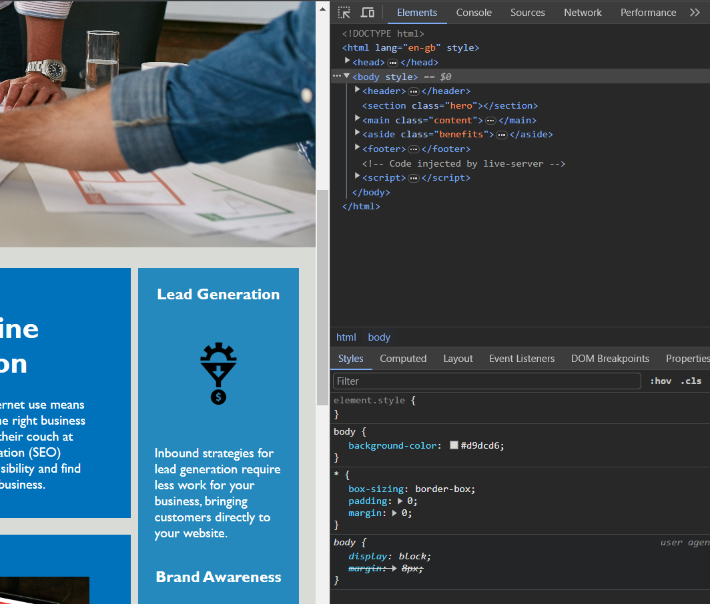

# horiseon-management-website

## About Horiseon

**Horiseon** is a marketing agency which focuses on utilising tools such as search engine optimisation, online reputation management and social media marketing to help their clients grow their business operations. This page has been designed with accesibility in mind to reach as many potential clients as possible through the use of assistive technologies implemented into the code. 

To read more about

  

click [here.](add-horiseon-deployed-link)

## Installation

<!--- N/A? as it's a website? if not then --->

1. Clone the repository named *horiseon-management-website*
2. Open GitBash/Terminal
3. Navigate with cd to the directory
4. Enter *code .* 
5. Make your changes in Visual Studio Code :shipit:

## Usage

:sparkle: Navigate to **Horiseon** [website](add-horiseon-link) 

:sparkle: Right click  
:sparkle: Select ***"Inspect"***  

:sparkle: ...and explore semantic HTML and CSS properties that optimize this page for search engines.
:sparkle: p.s. checkout navigation links and hidden footer!

## Credits
 
- **edX** bootcamp for content, Instructor, TAs, :stars: *Good-README-Guide* :P
- [W3school](https://www.w3schools.com/html/html5_semantic_elements.asp) for *semantic html elements*
- [W3school](https://www.w3schools.com/tags/tag_comment.asp) for *all html tags*
- **dawkins-pod-2** group from Slack :kissing_closed_eyes:
- [PYLounge](https://www.youtube.com/watch?v=NXNf9aYTCZ0&ab_channel=PyLounge-%D0%BF%D1%80%D0%BE%D0%B3%D1%80%D0%B0%D0%BC%D0%BC%D0%B8%D1%80%D0%BE%D0%B2%D0%B0%D0%BD%D0%B8%D0%B5%D0%BD%D0%B0Python%D0%B8%D0%B2%D1%81%D1%91%D0%BEIT) for *detailed README files*
- [GitHub](https://github.com/adam-p/markdown-here/wiki/Markdown-Cheatsheet#lists) for *markdown cheatsheet*
- [GitHub](https://github.com/GnuriaN/format-README/blob/master/emoji.md) for *emojis*
## Licence 

MIT License

Copyright (c) 2023

